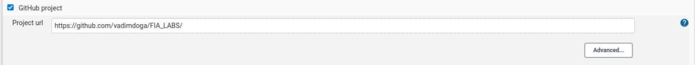
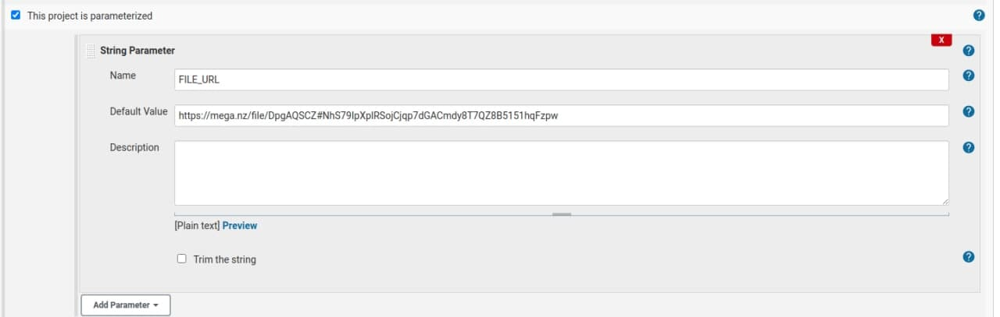
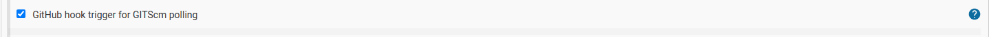
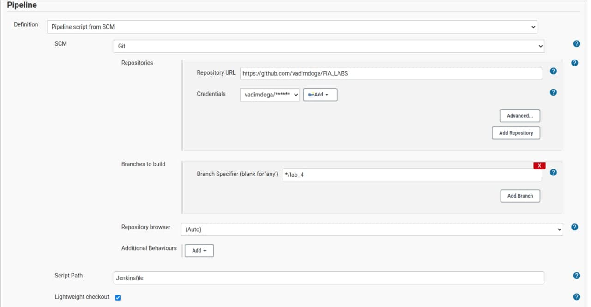

# CI/CD application

# Tools
1. Github
2. Jenkins (locally)
3. ngrok (locally)
4. MEGA (cloud storage)
5. Docker

# Description
This is a CI/CD pipeline which tests if the accuracy of the prediction is bigger than it was set. The model is located on a cloud storage(MEGA.nz), After a push on Gtihub is done, Jenkins downloads it from mega.nz and then gets the Github project. After it has everything the test is executed.

Jenkins is installed locally so it was neede to make `localhost` into a public URL. NGROK is a great tool which binds your local port with their public URL.

Three steps are declared in Jenkins pipeline file:
1. Prepare - which stands for getting `curl` and using a script(public script) to download the file
2. Build - which stands for building the whole project using docker
3. Test - which stands for running the builded docker container

# How to run?
1. MEGA
- Acess `mega.nz` and upload the model
- Get a shareable link for model
2. Jenkins
- RUN Jenkins docker container `docker run -u 0 -p 8080:8080 -p 50000:50000 -v /home/Documents/jenkins_home:/var/jenkins_home -v /var/run/docker.sock:/var/run/docker.sock -v $(which docker):/usr/bin/docker --network=host jenkins/jenkins:lts`
- Configure Jenkins
- Place the sharable link as a parameter from config images
3. NGROK
- Download ngrok from official website
- Run `./ngrok http 8080`
4. Github
- See configs bellow

# Configurations

## Jenkins + Github config
1. Create a pipeline
2. Go to Configure
3. Make sure that everything is like in images bellow:
4. Images:
 

5. Press Save

## Github config
1. Go to Github.com
2. Go to configs/webhooks
3. Change `Payload URL` to ngrok link
4. Make content-type: json
5. Press update webhook
